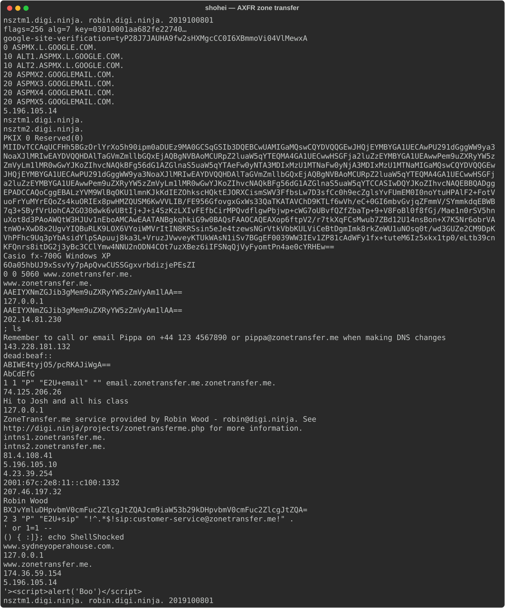

# shohei

[](https://crates.io/crates/shohei)
[](https://github.com/kent-tokyo/shohei/actions/workflows/ci.yml)
[](https://opensource.org/licenses/MIT)
[](https://www.rust-lang.org)

[日本語](README_ja.md) | [中文](README_zh.md)

**shohei** is a next-generation DNS diagnostic CLI. Where `dig` shows raw records, shohei visualizes the complete picture: the **DNSSEC chain of trust** from root to answer, the iterative resolution path hop-by-hop, and modern transports (DoH / DoT) — all rendered as color-coded trees in your terminal.

- **DNSSEC chain tree** — see every DS, DNSKEY, and trust step from `.` to your domain; add `-v` for key tags and algorithm names
- **Iterative resolution trace** — watch queries travel from root servers to TLD to authoritative NS
- **Authority + Additional sections** — see NS referrals and glue records when querying authoritative servers directly
- **N-way server comparison** — diff any number of resolvers simultaneously with `--compare`
- **DoH, DoT, and DoQ** — DNS-over-HTTPS, DNS-over-TLS, and DNS-over-QUIC built in
- **Zone transfer (AXFR)** — dump an entire zone from an authoritative server with `--axfr`
- **Multiple record types** — `--type a --type aaaa --type mx` in a single invocation
- **Reverse DNS** — `-x 1.2.3.4` resolves PTR records for IPv4 and IPv6
- **Stdin and file batch mode** — pipe a list of domains or use `-f domains.txt`
- **Human-readable TTL** — `300` displayed as `5m`, `3600` as `1h`
- **JSON output** — pipe-friendly for scripting and automation
- **Watch mode** — auto-refresh at a set interval with `--watch`
- **Short output** — data values only, one per line, with `--short`
- **Interactive TUI** — browse records, DNSSEC chain, and trace in a single terminal window (`--features tui`)

## Why shohei?

DNS tooling splits into three camps: classic tools (`dig`, `drill`, `delv`) that show raw output with no visual layer; modern alternatives (`dog`, `doggo`, `q`) that add colors and modern transports but skip deep diagnostics; and shohei, which combines both and adds the only terminal-native **DNSSEC chain-of-trust visualization** and **annotated iterative trace** in the space.

| Feature | shohei | dig | dog | doggo | q | delv | drill |
|---------|:------:|:---:|:---:|:-----:|:-:|:----:|:-----:|
| Colored output | ✓ | | ✓ | ✓ | ✓ | | |
| **DNSSEC chain-of-trust tree** | **✓** | | | | | | |
| DNSSEC validation | ✓ | ✓ | | | | ✓ | ✓ |
| **Iterative resolution trace (visual)** | **✓** | | | | | | |
| Authority + Additional sections | ✓ | ✓ | | | | ✓ | ✓ |
| N-way server comparison (`--compare`) | **✓** | | | | | | |
| Zone transfer (AXFR) | **✓** | ✓ | | | | | ✓ |
| Watch / auto-refresh (`--watch`) | **✓** | | | | | | |
| Script-friendly output (`--short`) | **✓** | | | | | | |
| **Multiple record types** (`--type a --type mx`) | **✓** | | | ✓ | | | |
| **Reverse DNS shorthand** (`-x 1.2.3.4`) | **✓** | ✓ | | ✓ | | | |
| Force TCP (`--tcp`) | ✓ | ✓ | | | | | ✓ |
| Disable recursion (`--no-recurse`) | ✓ | ✓ | | | | ✓ | ✓ |
| Query latency display | ✓ | ✓ | | ✓ | ✓ | | |
| DNS-over-HTTPS (DoH) | ✓ | ✓ | ✓ | ✓ | ✓ | | |
| DNS-over-TLS (DoT) | ✓ | ✓ | ✓ | ✓ | ✓ | | |
| DNS-over-QUIC (DoQ) | **✓** | | | | ✓ | | |
| JSON output | ✓ | ✓ | ✓ | ✓ | ✓ | | |
| Interactive TUI | **✓** | | | | | | |

> dig = BIND utils 9.16+; q = [natesales/q](https://github.com/natesales/q); delv = BIND DNSSEC-validating resolver; drill = ldns-based


## Demo

### Iterative Resolution Trace


### Watch Mode


### Interactive TUI


## Installation

```bash
cargo install shohei
```

For the interactive TUI mode:

```bash
cargo install shohei --features tui
```

Or download a pre-built binary from the [releases page](https://github.com/kent-tokyo/shohei/releases).

## Usage

### DNS record query

```bash
shohei google.com              # A records (default)
shohei google.com --type AAAA  # AAAA records
shohei google.com --type NS    # Nameservers
shohei gmail.com  --type MX    # Mail exchangers

# Multiple record types in one command
shohei google.com --type a --type aaaa --type mx
```


```bash
# Security / DNSSEC-related record types
shohei google.com --type caa       # Certificate Authority Authorization
shohei github.com --type sshfp     # SSH fingerprints
shohei _443._tcp.example.com --type tlsa  # DANE TLSA
```


### Reverse DNS

Resolve the PTR record for an IP address. IPv4 and IPv6 are both supported.

```bash
shohei -x 1.1.1.1              # → one.one.one.one
shohei -x 2606:4700:4700::1111 # IPv6 reverse lookup
```

### DNSSEC chain of trust

Validate the full DNSSEC chain from the root trust anchor down to the target domain.
Each zone's DS and DNSKEY records are checked individually.

```bash
shohei cloudflare.com --dnssec

# Verbose: show key tags, algorithm names, and KSK/ZSK roles
shohei cloudflare.com --dnssec --verbose
```


### Iterative resolution trace

Step through the full resolution path — root servers → TLD nameservers → authoritative nameservers.

```bash
shohei google.com --trace
```


### Modern transports

```bash
# DNS-over-HTTPS
shohei google.com --doh https://dns.google/dns-query

# DNS-over-TLS
shohei google.com --dot 1.1.1.1:853

# DNS-over-QUIC
shohei google.com --doq 8.8.8.8

# Custom resolver
shohei google.com --server 8.8.8.8
```

### Authority and Additional sections

When querying an authoritative server directly, shohei displays the **Authority Section** (NS referrals) and **Additional Section** (glue A/AAAA records) — matching `dig`'s default behavior.

```bash
# Query the .com TLD nameserver for google.com — shows NS referral + glue records
shohei google.com -s 192.5.6.30 --no-recurse

# Query an authoritative nameserver directly
shohei example.com -s 199.43.135.53 --no-recurse --type ns
```


### Force TCP

Force DNS queries over TCP instead of UDP. Useful for large responses that get truncated (TC bit set) or environments that block UDP/53.

```bash
shohei example.com -s 8.8.8.8 --tcp
```

### Short output

Strip all decoration and return just the record data — one value per line. Ideal for shell scripting.

```bash
shohei gmail.com --type MX --short
```


### Compare resolvers

Query the same domain from multiple DNS servers simultaneously and diff the results. Useful for detecting CDN anycast differences or verifying a new resolver. Repeat `--compare` for N-way comparison.

```bash
# Show that both servers return the same NS records
shohei cloudflare.com --type NS --server 8.8.8.8 --compare 1.1.1.1

# Reveal CDN-induced A record differences
shohei google.com --server 8.8.8.8 --compare 1.1.1.1

# N-way comparison across three resolvers
shohei google.com --server 8.8.8.8 --compare 1.1.1.1 --compare 9.9.9.9
```


### Zone transfer (AXFR)

Fetch the complete zone from an authoritative server. Requires `-s` to specify the authoritative nameserver.

```bash
shohei zonetransfer.me --axfr -s 81.4.108.41
```



### Batch / stdin mode

Pipe a newline-separated list of domains and shohei queries each one in sequence.
Lines starting with `#` are ignored as comments. You can also read targets from a file with `-f`.

```bash
echo -e "google.com\nexample.com\ncloudflare.com" | shohei
cat domains.txt | shohei --type mx --short
shohei -f domains.txt --type mx --short
```

### Watch mode

Repeat the query every N seconds and auto-refresh the display. Press Ctrl+C to stop.

```bash
shohei google.com --watch 5         # refresh every 5 seconds
shohei google.com --type A --watch 10
```

### Output formats

```bash
shohei google.com --output json   # JSON for scripting
shohei google.com --output plain  # No colors (CI-friendly)
```

### Interactive TUI (requires `--features tui`)

Pre-loads records, DNSSEC chain, and trace in parallel, then presents all three as navigable views.

```bash
shohei google.com --tui
```

```
 shohei — google.com
┌─ Records ──────────────────────────────────────────────────────────┐
│ Query: google.com (A IN)                                           │
│                                                                    │
│ NAME                                    TTL   TYPE   DATA          │
│ ────────────────────────────────────────────────────────────────── │
│ google.com.                             120   A      142.250.x.x   │
│ ...                                                                │
└────────────────────────────────────────────────────────────────────┘
 [r] Records  [d] DNSSEC  [t] Trace  [↑↓/jk] Scroll  [q] Quit
```

| Key | Action |
|-----|--------|
| `r` | Records view |
| `d` | DNSSEC chain view |
| `t` | Iterative trace view |
| `↑` / `k` | Scroll up |
| `↓` / `j` | Scroll down |
| `q` / `Esc` | Quit |

## Options

| Flag | Short | Description |
|------|-------|-------------|
| `--type <TYPE>` | `-t` | Record type (repeatable): `a`, `aaaa`, `mx`, `ns`, `txt`, `cname`, `soa`, `ptr`, `srv`, `https`, `svcb`, `naptr`, `dnskey`, `ds`, `rrsig`, `caa`, `tlsa`, `sshfp`, `nsec`, `nsec3`, `any` |
| `--reverse <IP>` | `-x` | Reverse DNS — auto-converts IP to PTR query (IPv4 and IPv6) |
| `--file <FILE>` | `-f` | Read domains from a file (one per line), like `dig -f` |
| `--dnssec` | `-d` | DNSSEC chain-of-trust validation tree |
| `--verbose` | `-v` | Show verbose detail (key tags, algorithms) in DNSSEC chain |
| `--trace` | | Iterative resolution path from root servers |
| `--no-recurse` | | Clear RD bit — query authoritative servers directly; shows Authority + Additional sections |
| `--axfr` | | Full zone transfer from the server specified with `-s` |
| `--tcp` | | Force TCP instead of UDP (requires `-s`; useful for large/truncated responses) |
| `--timeout <SECS>` | | DNS query timeout in seconds (default: 5, max: 60) |
| `--short` | | Output data values only, one per line (script-friendly) |
| `--watch <SECS>` | | Repeat query every N seconds; Ctrl+C to stop |
| `--compare <ADDR>` | | Query an additional server and diff; repeat for N-way comparison |
| `--doh <URL>` | | DNS-over-HTTPS (e.g. `https://dns.google/dns-query`) |
| `--dot <IP:PORT>` | | DNS-over-TLS (e.g. `1.1.1.1:853`) |
| `--doq <IP:PORT>` | | DNS-over-QUIC (e.g. `8.8.8.8` or `8.8.8.8:853`) |
| `--server <ADDR>` | `-s` | Custom DNS server (`8.8.8.8` or `8.8.8.8:53`) |
| `-4` | | Force queries over IPv4 transport |
| `-6` | | Force queries over IPv6 transport |
| `--output <FORMAT>` | `-o` | `colored` (default) · `plain` · `json` |
| `--tui` | | Interactive TUI (requires `--features tui`) |

## Trust States

| Badge | Meaning |
|-------|---------|
| `✓ SECURE` | DNSSEC-validated, full chain of trust verified |
| `⚠ INSECURE` | Zone unsigned, but parent has no DS delegation (expected) |
| `✗ BOGUS` | Validation failed — signature mismatch or broken chain |
| `? INDETERMINATE` | DNSSEC not requested, or result unclear |

## Built with

- [hickory-dns](https://hickory-dns.org/) — DNSSEC, DoH, DoT support
- [clap](https://crates.io/crates/clap) — CLI argument parsing
- [ratatui](https://ratatui.rs/) — TUI framework (optional `tui` feature)
- [owo-colors](https://crates.io/crates/owo-colors) — Terminal colors
- [comfy-table](https://crates.io/crates/comfy-table) — Record table rendering

## License

MIT — see [LICENSE](LICENSE)
