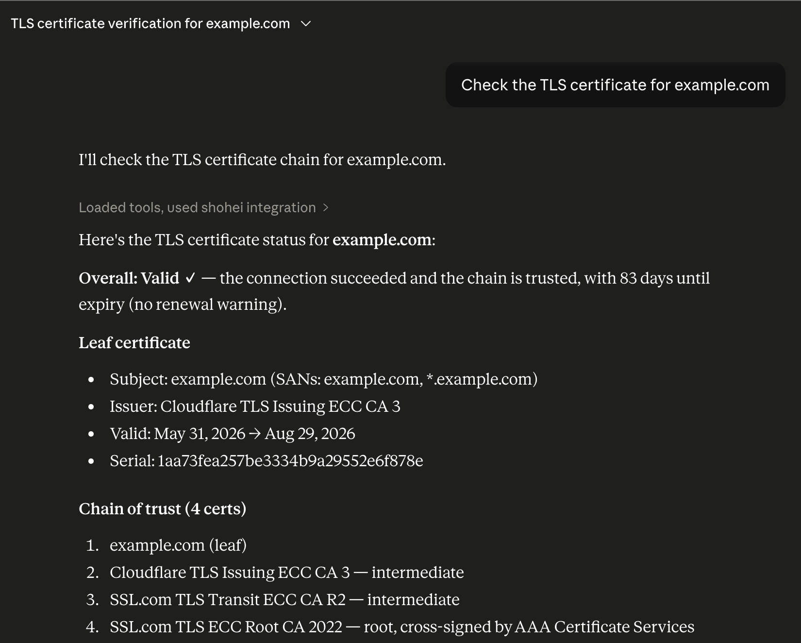

# shohei

[](https://crates.io/crates/shohei)
[](https://github.com/kent-tokyo/shohei/actions/workflows/ci.yml)
[](https://opensource.org/licenses/MIT)
[](https://www.rust-lang.org)

[English](README.md) | [中文](README_zh.md)

**shohei** — Rust インフラ診断ライブラリ × **Claude MCP サーバー**。DNS・TLS・メールセキュリティ・DNS伝播を自動検査。Claude に「example.com の TLS 証明書をチェック」と依頼すれば、自動で診断。DNSSEC チェーン検証・DANE/TLSA・モダンプロトコル搭載。Rust プロジェクトへの組込みも、AI エージェント連携も対応。

- **Claude MCP サーバー** — Claude Desktop から shohei の全機能を呼び出し可能。「example.com の TLS 証明書をチェック」と聞けば自動診断
- **TLS 証明書検査** — DANE/TLSA 検証（RFC 6698 完全対応）、証明書チェーン分析、有効期限警告、発行者チェーン確認
- **メールセキュリティスコアリング** — MX/SPF/DKIM/DMARC 検証、0～100 の準拠度スコア
- **DNS 伝播確認** — 6 大グローバルリゾルバー（Google・Cloudflare・Quad9 他）での一貫性確認
- **遅延ベンチマーク** — System・DoH・DoT・DoQ 複数ラウンドでの応答時間計測
- **DNSSEC チェーンツリー** — `.` から対象ドメインまで DS・DNSKEY の各ステップを可視化（ゾーンを並列で検証）；`-v` でキータグ・アルゴリズム名も表示
- **反復解決トレース** — ルートサーバー → TLD → 権威 NS へのクエリ経路をステップ表示
- **N-way サーバー比較** — `--compare` を複数回指定して何台でも同時比較
- **DoH / DoT / DoQ 対応** — DNS-over-HTTPS・DNS-over-TLS・DNS-over-QUIC をビルトインサポート
- **ゾーン転送（AXFR）** — `--axfr` で権威サーバーからゾーン全体を取得
- **複数レコードタイプ** — `--type a --type aaaa --type mx` で全タイプを並列で一括取得
- **逆引き DNS** — `-x 1.2.3.4` で IPv4/IPv6 の PTR レコードをすぐ解決
- **JSON 出力** — スクリプト・自動化に対応したパイプフレンドリーな出力
- **ウォッチモード** — `--watch` で定期的に自動更新
- **インタラクティブ TUI** — レコード・DNSSEC チェーン・トレースを1画面で閲覧 (`--features tui`)

## なぜ shohei？

### AI-First インフラ診断

ほとんどのインフラツールは CLI オンリー。**shohei は AI エージェント向けに設計されています：**

- **MCP サーバー対応**: Claude・ChatGPT・カスタム AI エージェントからコード不要で全機能を呼び出し可能
- **Claude Desktop 統合**: Claude に「example.com の TLS 証明書をチェック」と依頼 → 完全なチェーン分析を自動返答
- **構造化非同期 API**: すべての関数が Serde シリアライズ可能な型を返却（`DnsCheckResult`, `TlsCheckResult`, `EmailSecurityResult`） — AI エージェント向けに最適
- **CLI 不要・Python 不要**: 純粋な Rust ライブラリ + MCP サーバー；単一チェックから自動監視まで対応

### 開発者向け機能

- **ライブラリファースト設計**: Rust プロジェクト・CI/CD パイプライン・自動化フレームワークへの組込み
- **信頼チェーン検証**: DNS → DNSSEC → TLS → DANE/TLSA を一度に検証する唯一のオープンソースライブラリ
- **モダンプロトコル**: DoH・DoT・DoQ・DNSSEC・DANE/TLSA すべて搭載
- **自動化向け**: 並列クエリ・バッチ処理・複数リゾルバー同時チェック・プログラマティック API

**他ツール（`dig`・`dog`・`drill`）との比較**: shohei は再利用可能 — テスト・監視・CI/CD・**あるいは Claude へ渡して自動診断** に対応。

| 機能 | shohei | dig | dog | doggo | q | delv | drill |
|------|:------:|:---:|:---:|:-----:|:-:|:----:|:-----:|
| カラー出力 | ✓ | | ✓ | ✓ | ✓ | | |
| **DNSSEC 信頼の連鎖ツリー** | **✓** | | | | | | |
| DNSSEC 検証 | ✓ | ✓ | | | | ✓ | ✓ |
| **反復解決トレース（可視化）** | **✓** | | | | | | |
| Authority + Additional セクション | ✓ | ✓ | | | | ✓ | ✓ |
| N-way サーバー比較 (`--compare`) | **✓** | | | | | | |
| ゾーン転送（AXFR） | **✓** | ✓ | | | | | ✓ |
| 自動更新 (`--watch`) | **✓** | | | | | | |
| 短縮出力 (`--short`) | **✓** | | | | | | |
| **複数レコードタイプ一括クエリ** (`--type a --type mx`) | **✓** | | | ✓ | | | |
| **逆引きショートハンド** (`-x 1.2.3.4`) | **✓** | ✓ | | ✓ | | | |
| TCP 強制 (`--tcp`) | ✓ | ✓ | | | | | ✓ |
| 再帰無効 (`--no-recurse`) | ✓ | ✓ | | | | ✓ | ✓ |
| クエリ応答速度表示 | ✓ | ✓ | | ✓ | ✓ | | |
| DNS-over-HTTPS (DoH) | ✓ | ✓ | ✓ | ✓ | ✓ | | |
| DNS-over-TLS (DoT) | ✓ | ✓ | ✓ | ✓ | ✓ | | |
| DNS-over-QUIC (DoQ) | **✓** | | | | ✓ | | |
| JSON 出力 | ✓ | ✓ | ✓ | ✓ | ✓ | | |
| インタラクティブ TUI | **✓** | | | | | | |

> dig = BIND utils 9.16+; q = [natesales/q](https://github.com/natesales/q); delv = BIND DNSSEC 検証リゾルバ; drill = ldns ベース


## インストール

```bash
cargo install shohei
```

インタラクティブ TUI モードを使う場合:

```bash
cargo install shohei --features tui
```

または[リリースページ](https://github.com/kent-tokyo/shohei/releases)からビルド済みバイナリをダウンロードしてください。

## 使い方

### DNSレコードクエリ

```bash
shohei google.com              # A レコード（デフォルト）
shohei google.com --type AAAA  # AAAA レコード
shohei google.com --type NS    # ネームサーバー
shohei gmail.com  --type MX    # メール交換レコード

# 複数タイプを1コマンドで一括取得
shohei google.com --type a --type aaaa --type mx
```


```bash
# セキュリティ / DNSSEC 関連レコードタイプ
shohei google.com --type caa       # 認証局認可（CAA）
shohei github.com --type sshfp     # SSH フィンガープリント
shohei _443._tcp.example.com --type tlsa  # DANE TLSA
```


### 逆引き DNS

IP アドレスの PTR レコードを解決します。IPv4・IPv6 どちらも対応しています。

```bash
shohei -x 1.1.1.1              # → one.one.one.one
shohei -x 2606:4700:4700::1111 # IPv6 逆引き
```

### DNSSEC 信頼の連鎖

ルート信頼アンカーから対象ドメインまで、DNSSEC チェーン全体を検証します。
各ゾーンの DS・DNSKEY レコードを個別に確認します。

```bash
shohei cloudflare.com --dnssec

# 詳細表示: キータグ・アルゴリズム名・KSK/ZSK の種別を表示
shohei cloudflare.com --dnssec --verbose
```


### 反復解決トレース

ルートサーバー → TLD ネームサーバー → 権威ネームサーバーへの解決経路をステップ表示します。

```bash
shohei google.com --trace
```


### モダントランスポート

```bash
# DNS-over-HTTPS
shohei google.com --doh https://dns.google/dns-query

# DNS-over-TLS
shohei google.com --dot 1.1.1.1:853

# DNS-over-QUIC
shohei google.com --doq 8.8.8.8

# カスタムリゾルバ
shohei google.com --server 8.8.8.8
```

### Authority・Additional セクション

権威サーバーへ直接クエリすると、**Authority Section**（NS 委任）と **Additional Section**（グルー A/AAAA レコード）が表示されます。

```bash
# .com TLD ネームサーバーに google.com を問い合わせ — NS 委任＋グルーレコードを表示
shohei google.com -s 192.5.6.30 --no-recurse

# 権威ネームサーバーへ直接問い合わせ
shohei example.com -s 199.43.135.53 --no-recurse --type ns
```


### TCP 強制

UDP の代わりに TCP で DNS クエリを送信します。大きなレスポンスが切り詰められる場合や UDP/53 がブロックされている環境で有効です。

```bash
shohei example.com -s 8.8.8.8 --tcp
```

### 短縮出力

デコレーションを省き、レコードのデータ値のみを1行ずつ出力します。シェルスクリプトに最適です。

```bash
shohei gmail.com --type MX --short
```


### サーバー比較

同じドメインを複数のDNSサーバーに同時にクエリし、結果を差分表示します。CDNのエニーキャストによる差異の検出や、新しいリゾルバの検証に便利です。`--compare` を複数回指定すると N-way 比較ができます。

```bash
# 両サーバーが同じ NS レコードを返すことを確認
shohei cloudflare.com --type NS --server 8.8.8.8 --compare 1.1.1.1

# CDN によって異なる A レコードを確認
shohei google.com --server 8.8.8.8 --compare 1.1.1.1

# 3台同時比較
shohei google.com --server 8.8.8.8 --compare 1.1.1.1 --compare 9.9.9.9
```


### ゾーン転送（AXFR）

権威サーバーからゾーン全体を取得します。`-s` で権威ネームサーバーを指定する必要があります。

```bash
shohei zonetransfer.me --axfr -s 81.4.108.41
```


### バッチ / stdin モード

改行区切りのドメイン一覧をパイプすると、順番にクエリを実行します。
`#` で始まる行はコメントとして無視されます。`-f` でファイルから読み込むことも可能です。

```bash
echo -e "google.com\nexample.com\ncloudflare.com" | shohei
cat domains.txt | shohei --type mx --short
shohei -f domains.txt --type mx --short
```

### ウォッチモード

N秒ごとにクエリを繰り返し、画面を自動更新します。Ctrl+C で停止します。

```bash
shohei google.com --watch 5         # 5秒ごとに更新
shohei google.com --type A --watch 10
```

### 出力フォーマット

```bash
shohei google.com --output json   # スクリプト向け JSON
shohei google.com --output plain  # カラーなし（CI 環境向け）
```

### インタラクティブ TUI（`--features tui` が必要）

レコード・DNSSEC チェーン・トレースを並列でプリロードし、切り替え可能なビューで表示します。

```bash
shohei google.com --tui
```

```
 shohei — google.com
┌─ Records ──────────────────────────────────────────────────────────┐
│ Query: google.com (A IN)                                           │
│                                                                    │
│ NAME                                    TTL   TYPE   DATA          │
│ ────────────────────────────────────────────────────────────────── │
│ google.com.                             120   A      142.250.x.x   │
│ ...                                                                │
└────────────────────────────────────────────────────────────────────┘
 [r] Records  [d] DNSSEC  [t] Trace  [↑↓/jk] Scroll  [q] Quit
```

| キー | 操作 |
|------|------|
| `r` | レコードビュー |
| `d` | DNSSEC チェーンビュー |
| `t` | 反復トレースビュー |
| `↑` / `k` | 上にスクロール |
| `↓` / `j` | 下にスクロール |
| `q` / `Esc` | 終了 |

## オプション

| フラグ | 短縮 | 説明 |
|--------|------|------|
| `--type <TYPE>` | `-t` | レコードタイプ（複数可）: `a`, `aaaa`, `mx`, `ns`, `txt`, `cname`, `soa`, `ptr`, `srv`, `https`, `svcb`, `naptr`, `dnskey`, `ds`, `rrsig`, `caa`, `tlsa`, `sshfp`, `nsec`, `nsec3`, `any` |
| `--reverse <IP>` | `-x` | 逆引き — IP を PTR クエリに自動変換（IPv4・IPv6 対応） |
| `--file <FILE>` | `-f` | ファイルからドメイン一覧を読み込む（dig -f 相当） |
| `--dnssec` | `-d` | DNSSEC 信頼の連鎖の検証ツリーを表示 |
| `--verbose` | `-v` | 詳細表示（DNSSEC チェーンのキータグ・アルゴリズム等） |
| `--trace` | | ルートサーバーからの反復解決パスを表示 |
| `--no-recurse` | | RD ビットをクリア — 権威サーバーへ直接クエリ（Authority + Additional セクション表示） |
| `--axfr` | | `-s` で指定したサーバーからゾーン転送（AXFR）を実行 |
| `--tcp` | | UDP の代わりに TCP を強制（`-s` が必要；大きなレスポンスに有効） |
| `--timeout <SECS>` | | DNSクエリのタイムアウト秒数（デフォルト: 5、最大: 60） |
| `--short` | | データ値のみを1行ずつ出力（スクリプト向け） |
| `--watch <SECS>` | | N秒ごとにクエリを繰り返す（Ctrl+C で停止） |
| `--compare <ADDR>` | | 追加サーバーにもクエリして差分表示；複数回指定で N-way 比較 |
| `--doh <URL>` | | DNS-over-HTTPS（例: `https://dns.google/dns-query`） |
| `--dot <IP:PORT>` | | DNS-over-TLS（例: `1.1.1.1:853`） |
| `--doq <IP:PORT>` | | DNS-over-QUIC（例: `8.8.8.8` または `8.8.8.8:853`） |
| `--server <ADDR>` | `-s` | カスタムDNSサーバー（`8.8.8.8` または `8.8.8.8:53`） |
| `-4` | | IPv4 トランスポートを強制 |
| `-6` | | IPv6 トランスポートを強制 |
| `--output <FORMAT>` | `-o` | `colored`（デフォルト）· `plain` · `json` |
| `--tui` | | インタラクティブ TUI（`--features tui` が必要） |

## 信頼状態

| バッジ | 意味 |
|--------|------|
| `✓ SECURE` | DNSSECで検証済み、完全な信頼チェーンが確認済み |
| `⚠ INSECURE` | ゾーンは未署名だが、親にDSレコードなし（想定通り） |
| `✗ BOGUS` | 検証失敗 — 署名の不一致またはチェーンの破損 |
| `? INDETERMINATE` | 検証未要求、または結果不明 |

## MCP サーバー & Claude 統合

### ✅ v0.5.1+ で実装完了

**MCP（Model Context Protocol）サーバー** により、Claude Desktop と他の AI エージェントが shohei 診断を直接呼び出し可能です：

```bash
# 1. shohei をインストール
cargo install shohei

# 2. Claude Desktop 設定ファイルに登録：
# ~/.config/Claude/claude_desktop_config.json
{
  "mcpServers": {
    "shohei": {
      "command": "/path/to/shohei-mcp"
    }
  }
}

# 3. Claude Desktop を再起動
# 4. Claude に依頼：「example.com の TLS 証明書をチェック」
```

**Claude が使用可能な5つのツール：**
1. **check_dns** — DNS レコード検索（A、AAAA、MX、TXT、CNAME、NS など）
2. **check_tls_chain** — TLS 証明書検査 + DANE/TLSA 検証
3. **check_email_security** — SPF、DKIM、DMARC、MX レコード検証
4. **check_propagation_global** — 6 大グローバルリゾルバーでの DNS 一貫性確認
5. **benchmark_latency** — System・DoH・DoT・DoQ 複数ラウンドでの遅延計測

**例：** Claude がドメインを自動診断：
> 「example.com のメール設定が正しいか、TLS 証明書チェーンを確認して」
> → Claude が check_email_security + check_tls_chain を呼び出し → 完全な分析結果を返答



### その他の統合

- **Rust ライブラリ**: プロジェクトで `use shohei;` — 構造化非同期 API
- **CLI**: 手動検査：`shohei example.com --dnssec --trace`
- **JSON 出力**: スクリプト・自動化：`shohei example.com --output json`

## 使用クレート

- [hickory-dns](https://hickory-dns.org/) — DNSSEC、DoH、DoT 対応
- [clap](https://crates.io/crates/clap) — CLI 引数解析
- [ratatui](https://ratatui.rs/) — TUI フレームワーク（オプション `tui` フィーチャー）
- [owo-colors](https://crates.io/crates/owo-colors) — ターミナルカラー
- [comfy-table](https://crates.io/crates/comfy-table) — レコードテーブル描画

## ライセンス

MIT — [LICENSE](LICENSE) を参照
